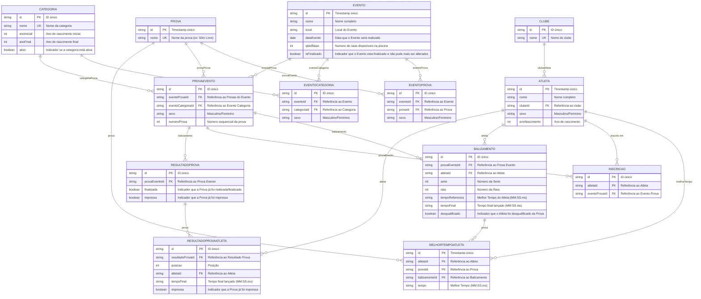

# 🗄️ Diagrama Entidade-Relacionamento (DER)

## Sistema de Balizamento de Natação

---

## 📊 Diagrama Visual



---

## 📋 Descrição das Entidades

### 1. **CLUBE**

Tabela que armazena os clubes/federações de natação.

| Atributo | Tipo   | Chave | Descrição             |
| -------- | ------ | ----- | --------------------- |
| `id`     | string | PK    | ID único do clube     |
| `nome`   | string | UK    | Nome do clube (único) |

**Exemplo de dados:**

```json
[
  { "id": "club-001", "nome": "Náutico" },
  { "id": "club-002", "nome": "Pinheiros" },
  { "id": "club-003", "nome": "Minas Tênis" }
]
```

**Relacionamento:** 1 CLUBE → N ATLETAS (Um clube filia muitos atletas)

---

### 2. **CATEGORIA**

Tabela que define as categorias de nado baseadas em idade (ano de nascimento).

| Atributo     | Tipo    | Chave | Descrição                                            |
| ------------ | ------- | ----- | ---------------------------------------------------- |
| `id`         | string  | PK    | ID único da categoria                                |
| `nome`       | string  | UK    | Nome da categoria (ex: "Juvenil 1")                  |
| `anoInicial` | int     |       | Ano de nascimento mínimo                             |
| `anoFinal`   | int     |       | Ano de nascimento máximo                             |
| `ativo`      | boolean |       | Indicador se a categoria está ativa e pode ser usada |

**Exemplo de dados:**

```json
[
  {
    "id": "cat-001",
    "nome": "Pré-Mirim",
    "anoInicial": 2017,
    "anoFinal": 2018,
    "ativo": true
  },
  {
    "id": "cat-002",
    "nome": "Mirim 1",
    "anoInicial": 2016,
    "anoFinal": 2016,
    "ativo": true
  },
  {
    "id": "cat-003",
    "nome": "Mirim 2",
    "anoInicial": 2015,
    "anoFinal": 2015,
    "ativo": true
  },
  {
    "id": "cat-004",
    "nome": "Petiz 1",
    "anoInicial": 2014,
    "anoFinal": 2014,
    "ativo": true
  },
  {
    "id": "cat-005",
    "nome": "Petiz 2",
    "anoInicial": 2013,
    "anoFinal": 2013,
    "ativo": true
  },
  {
    "id": "cat-006",
    "nome": "Infantil 1",
    "anoInicial": 2012,
    "anoFinal": 2012,
    "ativo": true
  },
  {
    "id": "cat-007",
    "nome": "Infantil 2",
    "anoInicial": 2011,
    "anoFinal": 2011,
    "ativo": true
  },
  {
    "id": "cat-008",
    "nome": "Juvenil 1",
    "anoInicial": 2010,
    "anoFinal": 2010,
    "ativo": true
  },
  {
    "id": "cat-009",
    "nome": "Juvenil 2",
    "anoInicial": 2009,
    "anoFinal": 2009,
    "ativo": true
  },
  {
    "id": "cat-010",
    "nome": "Júnior",
    "anoInicial": 2006,
    "anoFinal": 2008,
    "ativo": true
  },
  {
    "id": "cat-011",
    "nome": "Sênior",
    "anoInicial": 1950,
    "anoFinal": 2005,
    "ativo": true
  }
]
```

**Relacionamento:** 1 CATEGORIA → N ATLETAS (Uma categoria agrupa muitos atletas)

---

### 3. **ATLETA**

Tabela que armazena os dados dos atletas inscritos.

| Atributo        | Tipo   | Chave | Descrição                        |
| --------------- | ------ | ----- | -------------------------------- |
| `id`            | string | PK    | ID único (timestamp do cadastro) |
| `nome`          | string |       | Nome completo do atleta          |
| `clubeId`       | string | FK    | Referência ao CLUBE              |
| `sexo`          | string |       | Masculino ou Feminino            |
| `anoNascimento` | int    |       | Ano de nascimento                |
| `categoriaId`   | string | FK    | Referência à CATEGORIA           |

**Restrições:**

- `categoriaId` é determinado automaticamente pelo `anoNascimento` (query para buscar intervalo)
- `(id, clubeId)` = Unique (não há atletas duplicados no mesmo clube)

**Exemplo de dados:**

```json
[
  {
    "id": "1715000000000",
    "nome": "João Silva",
    "clubeId": "club-001",
    "sexo": "Masculino",
    "anoNascimento": 2010,
    "categoriaId": "cat-008"
  },
  {
    "id": "1715000000001",
    "nome": "Maria Santos",
    "clubeId": "club-002",
    "sexo": "Feminino",
    "anoNascimento": 2010,
    "categoriaId": "cat-008"
  }
]
```

**Relacionamentos:**

- N ATLETAS → 1 CLUBE (Muitos atletas em um clube)
- N ATLETAS → 1 CATEGORIA (Muitos atletas em uma categoria)
- 1 ATLETA → N RESULTADOS (Um atleta tem múltiplos resultados)

---

### 4. **PROVA**

Tabela que armazena as **provas de natação de forma genérica** (independente de eventos).

| Atributo | Tipo   | Chave | Descrição                       |
| -------- | ------ | ----- | ------------------------------- |
| `id`     | string | PK    | ID único (timestamp de criação) |
| `nome`   | string | UK    | Nome da prova (ex: "50m Livre") |

**Exemplo de dados:**

```json
[
  {
    "id": "prova-001",
    "nome": "50m Livre"
  },
  {
    "id": "prova-002",
    "nome": "100m Costas"
  },
  {
    "id": "prova-003",
    "nome": "200m Medley"
  },
  {
    "id": "prova-004",
    "nome": "4x50m Revezamento Livre"
  }
]
```

**Relacionamentos:**

- 1 PROVA → N PROVAEVENTO (Uma prova pode estar em múltiplos eventos)
- 1 PROVA → N MELHORTEMPOATLETA (Uma prova pode ter múltiplos tempos de atletas)

---

### 5. **EVENTO**

Tabela que armazena as **competições/eventos de natação**. Permite gerenciar múltiplas competições diferentes.

| Atributo       | Tipo    | Chave | Descrição                                                           |
| -------------- | ------- | ----- | ------------------------------------------------------------------- |
| `id`           | string  | PK    | ID único (timestamp de criação)                                     |
| `nome`         | string  | UK    | Nome completo do evento (ex: "Campeonato ...")                      |
| `local`        | string  |       | Local/cidade onde ocorre o evento                                   |
| `dataEvento`   | date    |       | Data de realização do evento                                        |
| `qtdeRaias`    | int     |       | Número de raias disponíveis na piscina                              |
| `isFinalizado` | boolean |       | Indicador que o evento está finalizado e não pode mais ser alterado |

**Restrições:**

- Quando `isFinalizado = true`, inscrições, balizamentos e resultados não podem mais ser modificados
- Apenas eventos com `isFinalizado = false` permitem edições

**Exemplo de dados:**

```json
[
  {
    "id": "evt-001",
    "nome": "Campeonato Estadual 2026 - Fase 1",
    "local": "São Paulo, SP",
    "dataEvento": "2026-06-15",
    "qtdeRaias": 8,
    "isFinalizado": false
  },
  {
    "id": "evt-002",
    "nome": "Campeonato Regional - Juvenil",
    "local": "Belo Horizonte, MG",
    "dataEvento": "2026-07-20",
    "qtdeRaias": 8,
    "isFinalizado": false
  },
  {
    "id": "evt-003",
    "nome": "Open de Natação - Adultos",
    "local": "Rio de Janeiro, RJ",
    "dataEvento": "2026-08-10",
    "qtdeRaias": 10,
    "isFinalizado": true
  }
]
```

**Significado dos exemplos:**

- `evt-001` e `evt-002`: Eventos em andamento, podem receber alterações
- `evt-003`: Evento finalizado, classificações já divulgadas, sem edições permitidas

**Relacionamento:** 1 EVENTO → N PROVAEVENTO (Um evento contém múltiplas provas)

---

### 6. **MELHORTEMPOATLETA**

Tabela que armazena o **histórico de melhores tempos** de cada atleta em cada prova.

| Atributo        | Tipo   | Chave | Descrição                 |
| --------------- | ------ | ----- | ------------------------- |
| `id`            | string | PK    | ID único (timestamp)      |
| `atletaId`      | string | FK    | Referência ao ATLETA      |
| `provaId`       | string | FK    | Referência à PROVA        |
| `balizamentoId` | string | FK    | Referência ao BALIZAMENTO |
| `tempo`         | string |       | Melhor tempo (MM:SS.ms)   |

**Restrições:**

- Chave única composta: `(atletaId, provaId)` - Um atleta tem um melhor tempo por prova

**Exemplo de dados:**

```json
[
  {
    "id": "mtp-001",
    "atletaId": "1715000000000",
    "provaId": "prova-001",
    "tempo": "00:27.15"
  },
  {
    "id": "mtp-002",
    "atletaId": "1715000000000",
    "provaId": "prova-002",
    "tempo": "00:58.42"
  },
  {
    "id": "mtp-003",
    "atletaId": "1715000000001",
    "provaId": "prova-001",
    "tempo": "00:29.05"
  }
]
```

**Relacionamentos:**

- N MELHORTEMPOATLETA → 1 ATLETA
- N MELHORTEMPOATLETA → 1 PROVA

---

### 7. **EVENTOPROVA**

Tabela de **junção** que define **quais provas estão habilitadas em qual evento, para qual sexo**.

| Atributo   | Tipo   | Chave | Descrição             |
| ---------- | ------ | ----- | --------------------- |
| `id`       | string | PK    | ID único (timestamp)  |
| `eventoId` | string | FK    | Referência ao EVENTO  |
| `provaId`  | string | FK    | Referência à PROVA    |
| `sexo`     | string |       | Masculino ou Feminino |

**Restrições:**

- Chave única composta: `(eventoId, provaId, sexo)` - Uma prova/sexo aparece uma única vez em cada evento
- Permite que cada evento tenha um conjunto customizável de provas por sexo

**Exemplo de dados:**

```json
[
  {
    "id": "ep-001",
    "eventoId": "evt-001",
    "provaId": "prova-001",
    "sexo": "Masculino"
  },
  {
    "id": "ep-002",
    "eventoId": "evt-001",
    "provaId": "prova-001",
    "sexo": "Feminino"
  },
  {
    "id": "ep-003",
    "eventoId": "evt-001",
    "provaId": "prova-002",
    "sexo": "Masculino"
  },
  {
    "id": "ep-004",
    "eventoId": "evt-001",
    "provaId": "prova-002",
    "sexo": "Feminino"
  },
  {
    "id": "ep-005",
    "eventoId": "evt-002",
    "provaId": "prova-001",
    "sexo": "Masculino"
  }
]
```

**Relacionamentos:**

- N EVENTOPROVA → 1 EVENTO
- N EVENTOPROVA → 1 PROVA

---

### 8. **EVENTOCATEGORIA**

Tabela de **junção** que define **quais categorias estão habilitadas em qual evento, para qual sexo**.

| Atributo      | Tipo   | Chave | Descrição              |
| ------------- | ------ | ----- | ---------------------- |
| `id`          | string | PK    | ID único (timestamp)   |
| `eventoId`    | string | FK    | Referência ao EVENTO   |
| `categoriaId` | string | FK    | Referência à CATEGORIA |
| `sexo`        | string |       | Masculino ou Feminino  |

**Restrições:**

- Chave única composta: `(eventoId, categoriaId, sexo)` - Uma categoria/sexo aparece uma única vez em cada evento
- Permite que eventos diferentes convidem diferentes faixas etárias por sexo

**Exemplo de dados:**

```json
[
  {
    "id": "ec-001",
    "eventoId": "evt-001",
    "categoriaId": "cat-006",
    "sexo": "Masculino"
  },
  {
    "id": "ec-002",
    "eventoId": "evt-001",
    "categoriaId": "cat-006",
    "sexo": "Feminino"
  },
  {
    "id": "ec-003",
    "eventoId": "evt-001",
    "categoriaId": "cat-008",
    "sexo": "Masculino"
  },
  {
    "id": "ec-004",
    "eventoId": "evt-001",
    "categoriaId": "cat-008",
    "sexo": "Feminino"
  },
  {
    "id": "ec-005",
    "eventoId": "evt-002",
    "categoriaId": "cat-008",
    "sexo": "Masculino"
  },
  {
    "id": "ec-006",
    "eventoId": "evt-002",
    "categoriaId": "cat-008",
    "sexo": "Feminino"
  }
]
```

**Relacionamentos:**

- N EVENTOCATEGORIA → 1 EVENTO
- N EVENTOCATEGORIA → 1 CATEGORIA

---

### 9. **PROVAEVENTO**

Tabela de **junção** que combina **EVENTOPROVA + EVENTOCATEGORIA** para criar as provas finais a serem disputadas (prova + categoria + sexo por evento).

| Atributo            | Tipo   | Chave | Descrição                                   |
| ------------------- | ------ | ----- | ------------------------------------------- |
| `id`                | string | PK    | ID único (timestamp)                        |
| `eventoProvaId`     | string | FK    | Referência à EVENTOPROVA                    |
| `eventoCategoriaId` | string | FK    | Referência à EVENTOCATEGORIA                |
| `sexo`              | string |       | Masculino ou Feminino (confirmação do sexo) |
| `numeroProva`       | int    |       | Número sequencial da prova neste evento     |

**Restrições:**

- Chave única composta: `(eventoProvaId, eventoCategoriaId)` - Garante uma única configuração por combinação
- O sexo deve ser consistente entre EVENTOPROVA e EVENTOCATEGORIA
- Gerada automaticamente quando ambas (EVENTOPROVA e EVENTOCATEGORIA) com mesmo sexo existem

**Exemplo de dados:**

```json
[
  {
    "id": "pev-001",
    "eventoProvaId": "ep-001",
    "eventoCategoriaId": "ec-001",
    "sexo": "Masculino",
    "numeroProva": 1
  },
  {
    "id": "pev-002",
    "eventoProvaId": "ep-002",
    "eventoCategoriaId": "ec-002",
    "sexo": "Feminino",
    "numeroProva": 2
  },
  {
    "id": "pev-003",
    "eventoProvaId": "ep-001",
    "eventoCategoriaId": "ec-003",
    "sexo": "Masculino",
    "numeroProva": 3
  },
  {
    "id": "pev-004",
    "eventoProvaId": "ep-003",
    "eventoCategoriaId": "ec-001",
    "sexo": "Masculino",
    "numeroProva": 4
  }
]
```

**Significado dos exemplos:**

- `pev-001`: 50m Livre (ep-001) × Infantil 1 Masculino (ec-001) = Prova 1
- `pev-002`: 50m Livre (ep-002) × Infantil 1 Feminino (ec-002) = Prova 2
- `pev-003`: 50m Livre (ep-001) × Juvenil 1 Masculino (ec-003) = Prova 3
- `pev-004`: 100m Costas (ep-003) × Infantil 1 Masculino (ec-001) = Prova 4

**Relacionamentos:**

- N PROVAEVENTO → 1 EVENTOPROVA
- N PROVAEVENTO → 1 EVENTOCATEGORIA
- 1 PROVAEVENTO → N INSCRICAO
- 1 PROVAEVENTO → N BALIZAMENTO

---

### 10. **INSCRICAO**

Tabela de **junção** que registra **qual atleta está inscrito em qual prova (PROVAEVENTO) de qual evento**. Essencial para rastrear inscrições e permitir balizamento posterior.

| Atributo        | Tipo   | Chave  | Descrição                |
| --------------- | ------ | ------ | ------------------------ |
| `id`            | string | PK     | ID único (timestamp)     |
| `atletaId`      | string | FK, PK | Referência ao ATLETA     |
| `eventoProvaId` | string | FK, PK | Referência à PROVAEVENTO |

**Restrições:**

- Chave única composta: `(atletaId, eventoProvaId)` - Um atleta inscrito uma única vez por prova/evento
- Impede inscrição duplicada na mesma prova de um evento
- Cada inscrição gera um BALIZAMENTO futuro

**Exemplo de dados:**

```json
[
  {
    "id": "insc-001",
    "atletaId": "1715000000000",
    "eventoProvaId": "pev-001"
  },
  {
    "id": "insc-002",
    "atletaId": "1715000000000",
    "eventoProvaId": "pev-004"
  },
  {
    "id": "insc-003",
    "atletaId": "1715000000001",
    "eventoProvaId": "pev-002"
  },
  {
    "id": "insc-004",
    "atletaId": "1715000000005",
    "eventoProvaId": "pev-001"
  },
  {
    "id": "insc-005",
    "atletaId": "1715000000010",
    "eventoProvaId": "pev-002"
  }
]
```

**Significado dos exemplos:**

- `insc-001`: João (1715000000000) inscrito em 50m Livre Masc Infantil 1 (pev-001)
- `insc-002`: João inscrito também em 100m Costas Masc Infantil 1 (pev-004)
- `insc-003`: Maria (1715000000001) inscrita em 50m Livre Fem Infantil 1 (pev-002)
- `insc-004`: Outro atleta (1715000000005) também em 50m Livre Masc Infantil 1
- `insc-005`: Terceiro atleta (1715000000010) em 50m Livre Fem Infantil 1

**Relacionamentos:**

- N INSCRICAO → 1 ATLETA (Um atleta pode ter múltiplas inscrições)
- N INSCRICAO → 1 PROVAEVENTO (Uma prova/evento pode ter múltiplos atletas inscritos)

---

### 11. **BALIZAMENTO**

Tabela que armazena o **balizamento real** (série, raia e tempos) de cada atleta em cada prova de cada evento.

| Atributo          | Tipo    | Chave | Descrição                                   |
| ----------------- | ------- | ----- | ------------------------------------------- |
| `id`              | string  | PK    | ID único (timestamp)                        |
| `eventoProvaId`   | string  | FK    | Referência à PROVAEVENTO                    |
| `atletaId`        | string  | FK    | Referência ao ATLETA                        |
| `serie`           | int     |       | Número da série (1, 2, 3...)                |
| `raia`            | int     |       | Número da raia (1-10)                       |
| `tempoReferencia` | string  |       | Melhor tempo anterior (MM:SS.ms)            |
| `tempoFinal`      | string  |       | Tempo final obtido na competição (MM:SS.ms) |
| `desqualificado`  | boolean |       | Indicador se o atleta foi desqualificado    |

**Restrições:**

- Chave única composta: `(provaEventoId, atletaId)` - Um atleta em uma prova/evento uma única vez
- `serie` e `raia` não podem estar vazios
- `tempoReferencia` é preenchido automaticamente do MELHORTEMPOATLETA
- `desqualificado` determina se o atleta é eliminado da prova (não entra na classificação)

**Exemplo de dados:**

```json
[
  {
    "id": "bal-001",
    "provaEventoId": "pev-001",
    "atletaId": "1715000000000",
    "serie": 1,
    "raia": 4,
    "tempoReferencia": "00:27.15",
    "tempoFinal": "00:26.98",
    "desqualificado": false
  },
  {
    "id": "bal-002",
    "provaEventoId": "pev-001",
    "atletaId": "1715000000005",
    "serie": 1,
    "raia": 6,
    "tempoReferencia": "00:28.50",
    "tempoFinal": null,
    "desqualificado": true
  },
  {
    "id": "bal-003",
    "provaEventoId": "pev-002",
    "atletaId": "1715000000001",
    "serie": 2,
    "raia": 3,
    "tempoReferencia": "00:29.05",
    "tempoFinal": "00:28.87",
    "desqualificado": false
  },
  {
    "id": "bal-004",
    "provaEventoId": "pev-002",
    "atletaId": "1715000000010",
    "serie": 2,
    "raia": 5,
    "tempoReferencia": "00:30.20",
    "tempoFinal": "00:29.15",
    "desqualificado": false
  }
]
```

**Significado dos exemplos:**

- `bal-001`: João (1715000000000) na Série 1 Raia 4 - Completou com 00:26.98 e não foi desqualificado
- `bal-002`: Atleta 1715000000005 na Série 1 Raia 6 - Desqualificado (sem tempo final)
- `bal-003`: Maria (1715000000001) na Série 2 Raia 3 - Completou com 00:28.87
- `bal-004`: Atleta 1715000000010 na Série 2 Raia 5 - Completou com 00:29.15

**Relacionamentos:**

- N BALIZAMENTO → 1 PROVAEVENTO
- N BALIZAMENTO → 1 ATLETA

---

### 12. **RESULTADOPROVA**

Tabela que armazena o **status de finalização e impressão** de cada prova em cada evento. Essencial para rastrear quais provas já foram realizadas e têm resultados finais.

| Atributo        | Tipo    | Chave | Descrição                              |
| --------------- | ------- | ----- | -------------------------------------- |
| `id`            | string  | PK    | ID único (timestamp)                   |
| `provaEventoId` | string  | FK    | Referência à PROVAEVENTO               |
| `finalizada`    | boolean |       | Indicador que a prova já foi realizada |
| `impressa`      | boolean |       | Indicador que o resultado foi impresso |

**Restrições:**

- Chave única: `provaEventoId` - Uma única entrada de resultado por prova/evento
- `finalizada = true` → prova foi disputada e resultados estão registrados
- `impressa = true` → resultado foi impresso/divulgado oficialmente

**Exemplo de dados:**

```json
[
  {
    "id": "rp-001",
    "provaEventoId": "pev-001",
    "finalizada": true,
    "impressa": true
  },
  {
    "id": "rp-002",
    "provaEventoId": "pev-002",
    "finalizada": true,
    "impressa": false
  },
  {
    "id": "rp-003",
    "provaEventoId": "pev-003",
    "finalizada": false,
    "impressa": false
  },
  {
    "id": "rp-004",
    "provaEventoId": "pev-004",
    "finalizada": true,
    "impressa": true
  }
]
```

**Significado dos exemplos:**

- `rp-001`: Prova pev-001 (50m Livre Masc Infantil 1) finalizada e resultado já impresso
- `rp-002`: Prova pev-002 (50m Livre Fem Infantil 1) finalizada mas resultado ainda não impresso
- `rp-003`: Prova pev-003 ainda não foi realizada (em aberto)
- `rp-004`: Prova pev-004 (100m Costas Masc Infantil 1) finalizada e resultado impresso

**Relacionamentos:**

- N RESULTADOPROVA → 1 PROVAEVENTO
- 1 RESULTADOPROVA → N RESULTADOPROVAATLETA

---

### 13. **RESULTADOPROVAATLETA**

Tabela que armazena a **classificação final de cada atleta** em cada prova. Registra a posição, tempo final e status de impressão por atleta.

| Atributo           | Tipo    | Chave | Descrição                                  |
| ------------------ | ------- | ----- | ------------------------------------------ |
| `id`               | string  | PK    | ID único (timestamp)                       |
| `resultadoProvaId` | string  | FK    | Referência ao RESULTADOPROVA               |
| `posicao`          | int     |       | Posição final na classificação (1º, 2º...) |
| `atletaId`         | string  | FK    | Referência ao ATLETA                       |
| `tempoFinal`       | string  |       | Tempo final lançado (MM:SS.ms)             |
| `impressa`         | boolean |       | Indicador que este resultado foi impresso  |

**Restrições:**

- Chave única composta: `(resultadoProvaId, atletaId)` - Um atleta uma única vez na classificação
- `posicao` será null se o atleta foi desqualificado
- `tempoFinal` será null se o atleta foi desqualificado
- Ordenação: `posicao` ordena os atletas do melhor (1º) para o pior (Nº)

**Exemplo de dados:**

```json
[
  {
    "id": "rpa-001",
    "resultadoProvaId": "rp-001",
    "posicao": 1,
    "atletaId": "1715000000000",
    "tempoFinal": "00:26.98",
    "impressa": true
  },
  {
    "id": "rpa-002",
    "resultadoProvaId": "rp-001",
    "posicao": 2,
    "atletaId": "1715000000012",
    "tempoFinal": "00:27.45",
    "impressa": true
  },
  {
    "id": "rpa-003",
    "resultadoProvaId": "rp-001",
    "posicao": null,
    "atletaId": "1715000000005",
    "tempoFinal": null,
    "impressa": true
  },
  {
    "id": "rpa-004",
    "resultadoProvaId": "rp-002",
    "posicao": 1,
    "atletaId": "1715000000001",
    "tempoFinal": "00:28.87",
    "impressa": false
  },
  {
    "id": "rpa-005",
    "resultadoProvaId": "rp-002",
    "posicao": 2,
    "atletaId": "1715000000010",
    "tempoFinal": "00:29.15",
    "impressa": false
  }
]
```

**Significado dos exemplos:**

- `rpa-001`: João (1715000000000) ficou em 1º lugar em pev-001 com 00:26.98 - Resultado impresso
- `rpa-002`: Atleta 1715000000012 ficou em 2º lugar em pev-001 com 00:27.45 - Resultado impresso
- `rpa-003`: Atleta 1715000000005 foi desqualificado em pev-001 (posicao e tempoFinal = null) - Resultado impresso
- `rpa-004`: Maria (1715000000001) ficou em 1º lugar em pev-002 com 00:28.87 - Resultado não impresso
- `rpa-005`: Atleta 1715000000010 ficou em 2º lugar em pev-002 com 00:29.15 - Resultado não impresso

**Relacionamentos:**

- N RESULTADOPROVAATLETA → 1 RESULTADOPROVA
- N RESULTADOPROVAATLETA → 1 ATLETA

---

## 🔗 Relacionamentos Detalhados

### **CLUBE → ATLETA** (1:N)

- **Descrição:** Um clube filia muitos atletas; cada atleta pertence a um único clube
- **Cardinalidade:** 1 CLUBE : 0..N ATLETAS
- **Exemplo:** Náutico tem 50 atletas inscritos

### **CATEGORIA → ATLETA** (1:N)

- **Descrição:** Uma categoria agrupa muitos atletas; categoria determinada por ano de nascimento
- **Cardinalidade:** 1 CATEGORIA : 0..N ATLETAS
- **Cálculo:** `anoNascimento ∈ [anoInicial, anoFinal]`

### **EVENTO → EVENTOPROVA** (1:N)

- **Descrição:** Um evento habilita múltiplas provas (com diferentes sexos)
- **Cardinalidade:** 1 EVENTO : 1..N EVENTOPROVA
- **Exemplo:** Campeonato Estadual habilita 50m Livre (Masc e Fem), 100m Costas (Masc e Fem), etc.

### **PROVA → EVENTOPROVA** (1:N)

- **Descrição:** Uma prova pode ser habilitada em múltiplos eventos
- **Cardinalidade:** 1 PROVA : 1..N EVENTOPROVA
- **Exemplo:** 50m Livre é prova em 5 campeonatos diferentes

### **EVENTO → EVENTOCATEGORIA** (1:N)

- **Descrição:** Um evento convida múltiplas categorias (com diferentes sexos)
- **Cardinalidade:** 1 EVENTO : 1..N EVENTOCATEGORIA
- **Exemplo:** Campeonato Estadual convida Infantil 1 (Masc e Fem), Juvenil 1 (Masc e Fem), etc.

### **CATEGORIA → EVENTOCATEGORIA** (1:N)

- **Descrição:** Uma categoria pode participar de múltiplos eventos
- **Cardinalidade:** 1 CATEGORIA : 1..N EVENTOCATEGORIA
- **Exemplo:** Juvenil 1 participa do Campeonato Estadual, Regional e Open

### **EVENTOPROVA → PROVAEVENTO** (1:N)

- **Descrição:** Uma prova habilitada em um evento se combina com categorias para criar PROVAEVENTO
- **Cardinalidade:** 1 EVENTOPROVA : 1..N PROVAEVENTO
- **Exemplo:** 50m Livre Masculino se combina com Infantil 1 Masc, Juvenil 1 Masc, etc.

### **EVENTOCATEGORIA → PROVAEVENTO** (1:N)

- **Descrição:** Uma categoria habilitada em um evento se combina com provas para criar PROVAEVENTO
- **Cardinalidade:** 1 EVENTOCATEGORIA : 1..N PROVAEVENTO
- **Exemplo:** Infantil 1 Masculino se combina com 50m Livre Masc, 100m Costas Masc, etc.

### **ATLETA → MELHORTEMPOATLETA** (1:N)

- **Descrição:** Um atleta tem melhor tempo registrado em múltiplas provas
- **Cardinalidade:** 1 ATLETA : 0..N MELHORTEMPOATLETA
- **Exemplo:** João tem PR em 50m Livre, 100m Costas, etc.

### **PROVA → MELHORTEMPOATLETA** (1:N)

- **Descrição:** Uma prova tem muitos melhores tempos (um por atleta)
- **Cardinalidade:** 1 PROVA : 0..N MELHORTEMPOATLETA

### **PROVAEVENTO → INSCRICAO** (1:N)

- **Descrição:** Uma prova em um evento pode ter múltiplos atletas inscritos
- **Cardinalidade:** 1 PROVAEVENTO : 1..N INSCRICAO
- **Exemplo:** 50m Livre Masculino Infantil 1 tem 15 atletas inscritos

### **PROVAEVENTO → BALIZAMENTO** (1:N)

- **Descrição:** Uma prova em um evento tem múltiplos atletas balizados
- **Cardinalidade:** 1 PROVAEVENTO : 1..N BALIZAMENTO
- **Exemplo:** 50m Livre Masculino Infantil 1 tem 15 atletas balizados em 2 séries

### **ATLETA → BALIZAMENTO** (1:N)

- **Descrição:** Um atleta participa de múltiplas provas em múltiplos eventos
- **Cardinalidade:** 1 ATLETA : 0..N BALIZAMENTO
- **Exemplo:** João participa de Livre, Costas, Peito em um evento

---

## 🔄 Fluxo de Dados (Arquitetura Multi-Evento com EVENTOPROVA e EVENTOCATEGORIA)

```
┌────────────────────────────────────────────────────────────────────┐
│ 1. SETUP INICIAL (Admin - Uma única vez)                          │
│    - Criar CATEGORIAS (11 categorias FINA)                        │
│    - Criar CLUBES (50-100 clubes)                                 │
│    - Criar PROVAS genéricas (50m, 100m, 200m, etc.)              │
└────────────────────────────────────────────────────────────────────┘
                            ↓
┌────────────────────────────────────────────────────────────────────┐
│ 2. CRIAR EVENTO (Admin - Para cada competição)                    │
│    - Nome, Local, Data, Qtde Raias, isFinalizado                 │
│    ↓ Passo 2a: Habilitar Provas por Sexo                         │
│    - Criar EVENTOPROVA (quais provas, para qual sexo)            │
│      • Ex: 50m Livre Masculino, 50m Livre Feminino              │
│      • Ex: 100m Costas Masculino, 100m Costas Feminino          │
│    ↓ Passo 2b: Habilitar Categorias por Sexo                    │
│    - Criar EVENTOCATEGORIA (quais categorias, para qual sexo)   │
│      • Ex: Infantil 1 Masculino, Infantil 1 Feminino            │
│      • Ex: Juvenil 1 Masculino, Juvenil 1 Feminino              │
│    ↓ Passo 2c: Sistema gera combinações                         │
│    - Sistema cria automaticamente PROVAEVENTO:                    │
│      • Combina cada EVENTOPROVA com cada EVENTOCATEGORIA        │
│      • Mesmo sexo em ambas                                       │
│      • Atribui NUMEROOPROVA sequencial                           │
│      • Ex: 50m Livre Masc + Infantil 1 Masc = Prova 1          │
└────────────────────────────────────────────────────────────────────┘
                            ↓
┌────────────────────────────────────────────────────────────────────┐
│ 3. INSCRIÇÕES (Coordenador de evento)                             │
│    - Atletas se inscrevem em PROVAEVENTO (prova específica)      │
│      • Ex: João (Juvenil 1 Masc) se inscreve em 50m Livre Masc  │
│    - Criar INSCRICAO(atletaId, eventoProvaId)                   │
│    - Validação: Atleta deve estar na categoria/sexo da prova    │
└────────────────────────────────────────────────────────────────────┘
                            ↓
┌────────────────────────────────────────────────────────────────────┐
│ 4. BALIZAMENTO (Antes do evento)                                   │
│    - Para cada PROVAEVENTO com atletas inscritos:                │
│      • Recuperar todos os INSCRICAO dessa prova                  │
│      • Ordenar atletas por tempoReferencia (MELHORTEMPOATLETA)  │
│      • Distribuir em SÉRIES (máx 8 raias por série)             │
│    - Criar BALIZAMENTO com série, raia, tempoReferencia         │
└────────────────────────────────────────────────────────────────────┘
                            ↓
┌────────────────────────────────────────────────────────────────────┐
│ 5. COMPETIÇÃO (Lançamento de tempos)                              │
│    - Durante o evento, para cada atleta na série:                 │
│      • Lançar TEMPOFINLA no BALIZAMENTO                          │
│      • Atualizar MELHORTEMPOATLETA se melhorou PR               │
└────────────────────────────────────────────────────────────────────┘
                            ↓
┌────────────────────────────────────────────────────────────────────┐
│ 6. CLASSIFICAÇÃO (Após o evento)                                   │
│    - Para cada PROVAEVENTO:                                        │
│      • Ordenar BALIZAMENTO por tempoFinal (crescente)             │
│      • Atribuir POSIÇÃO (ranking 1°, 2°, 3°...)                   │
│      • Gerar relatório de classificação                           │
│      • Gerar certificados/medalhas                                │
└────────────────────────────────────────────────────────────────────┘
```

---

## 💾 Mapeamento para localStorage (Novo)

```javascript
// localStorage['clubes']
[
  { id: "club-001", nome: "Náutico" },
  { id: "club-002", nome: "Pinheiros" },
  { id: "club-003", nome: "Minas Tênis" },
][
  // localStorage['categorias'] (pré-configurado)
  ({
    id: "cat-001",
    nome: "Pré-Mirim",
    anoInicial: 2017,
    anoFinal: 2018,
    ativo: true,
  },
  {
    id: "cat-008",
    nome: "Juvenil 1",
    anoInicial: 2010,
    anoFinal: 2010,
    ativo: true,
  },
  {
    id: "cat-011",
    nome: "Sênior",
    anoInicial: 1950,
    anoFinal: 2005,
    ativo: true,
  })
][
  // localStorage['atletas']
  ({
    id: "1715000000000",
    nome: "João Silva",
    clubeId: "club-001",
    sexo: "Masculino",
    anoNascimento: 2010,
  },
  {
    id: "1715000000001",
    nome: "Maria Santos",
    clubeId: "club-002",
    sexo: "Feminino",
    anoNascimento: 2010,
  })
][
  // localStorage['provas'] (genéricas)
  ({ id: "prova-001", nome: "50m Livre" },
  { id: "prova-002", nome: "100m Costas" },
  { id: "prova-003", nome: "200m Medley" })
][
  // localStorage['eventos']
  ({
    id: "evt-001",
    nome: "Campeonato Estadual 2026 - Fase 1",
    local: "São Paulo, SP",
    dataEvento: "2026-06-15",
    qtdeRaias: 8,
    isFinalizado: false,
  },
  {
    id: "evt-003",
    nome: "Open de Natação - Adultos",
    local: "Rio de Janeiro, RJ",
    dataEvento: "2026-08-10",
    qtdeRaias: 10,
    isFinalizado: true,
  })
][
  // localStorage['eventosProvas'] ← NOVO
  ({
    id: "ep-001",
    eventoId: "evt-001",
    provaId: "prova-001",
    sexo: "Masculino",
  },
  { id: "ep-002", eventoId: "evt-001", provaId: "prova-001", sexo: "Feminino" },
  {
    id: "ep-003",
    eventoId: "evt-001",
    provaId: "prova-002",
    sexo: "Masculino",
  },
  { id: "ep-004", eventoId: "evt-001", provaId: "prova-002", sexo: "Feminino" },
  {
    id: "ep-005",
    eventoId: "evt-003",
    provaId: "prova-001",
    sexo: "Masculino",
  })
][
  // localStorage['eventosCategorias'] ← NOVO
  ({
    id: "ec-001",
    eventoId: "evt-001",
    categoriaId: "cat-001",
    sexo: "Masculino",
  },
  {
    id: "ec-002",
    eventoId: "evt-001",
    categoriaId: "cat-001",
    sexo: "Feminino",
  },
  {
    id: "ec-003",
    eventoId: "evt-001",
    categoriaId: "cat-008",
    sexo: "Masculino",
  },
  {
    id: "ec-004",
    eventoId: "evt-001",
    categoriaId: "cat-008",
    sexo: "Feminino",
  },
  {
    id: "ec-005",
    eventoId: "evt-003",
    categoriaId: "cat-011",
    sexo: "Masculino",
  })
][
  // localStorage['provasEventos'] (Combinações EVENTOPROVA + EVENTOCATEGORIA)
  ({
    id: "pev-001",
    eventoProvaId: "ep-001",
    eventoCategoriaId: "ec-001",
    sexo: "Masculino",
    numeroProva: 1,
  },
  {
    id: "pev-002",
    eventoProvaId: "ep-002",
    eventoCategoriaId: "ec-002",
    sexo: "Feminino",
    numeroProva: 2,
  },
  {
    id: "pev-003",
    eventoProvaId: "ep-001",
    eventoCategoriaId: "ec-003",
    sexo: "Masculino",
    numeroProva: 3,
  },
  {
    id: "pev-004",
    eventoProvaId: "ep-003",
    eventoCategoriaId: "ec-001",
    sexo: "Masculino",
    numeroProva: 4,
  })
][
  // localStorage['inscricoes']
  ({ id: "insc-001", atletaId: "1715000000000", eventoProvaId: "pev-001" },
  { id: "insc-002", atletaId: "1715000000000", eventoProvaId: "pev-004" },
  { id: "insc-003", atletaId: "1715000000001", eventoProvaId: "pev-002" },
  { id: "insc-004", atletaId: "1715000000005", eventoProvaId: "pev-001" })
][
  // localStorage['melhorTempos'] (histórico de PRs)
  ({
    id: "mtp-001",
    atletaId: "1715000000000",
    provaId: "prova-001",
    tempo: "00:27.15",
  },
  {
    id: "mtp-002",
    atletaId: "1715000000001",
    provaId: "prova-001",
    tempo: "00:29.05",
  })
][
  // localStorage['balizamentos']
  ({
    id: "bal-001",
    eventoProvaId: "pev-001",
    atletaId: "1715000000000",
    serie: 1,
    raia: 4,
    tempoReferencia: "00:27.15",
    tempoFinal: "00:26.98",
  },
  {
    id: "bal-002",
    eventoProvaId: "pev-002",
    atletaId: "1715000000001",
    serie: 2,
    raia: 3,
    tempoReferencia: "00:29.05",
    tempoFinal: "00:28.87",
  })
];
```

---

## ✨ Vantagens do Novo DER (Multi-Evento com EVENTOPROVA e EVENTOCATEGORIA)

| Vantagem                        | Descrição                                                           |
| ------------------------------- | ------------------------------------------------------------------- |
| **Multi-evento**                | Suporta múltiplas competições reutilizando atletas, clubes, provas  |
| **Flexibilidade de Provas**     | Cada evento pode habilitar diferentes provas (EVENTOPROVA)          |
| **Flexibilidade de Categorias** | Cada evento pode convidar diferentes categorias (EVENTOCATEGORIA)   |
| **Separação por Sexo**          | Provas e categorias separadas por sexo em cada evento               |
| **Histórico de tempos**         | MELHORTEMPOATLETA mantém PR de cada atleta por prova                |
| **Contextualização**            | PROVAEVENTO combina EVENTOPROVA + EVENTOCATEGORIA                   |
| **Balizamento rico**            | BALIZAMENTO armazena série, raia, e ambos os tempos                 |
| **Integridade referencial**     | Clubes e categorias predefinidos evitam inconsistências             |
| **Escalabilidade**              | Fácil adicionar novos eventos reutilizando estrutura base           |
| **Sem redundância**             | Cada dado armazenado apenas uma vez                                 |
| **Cálculo automático**          | Categoria calculada dinamicamente pelo ano de nascimento            |
| **Queries eficientes**          | Joins por ID diretos, sem strings concatenadas                      |
| **Auditoria completa**          | Histórico completo de tempos por atleta e evento                    |
| **Manutenibilidade**            | Mudanças em categorias/provas refletem em todos eventos             |
| **Geração Automática**          | PROVAEVENTO gerado automaticamente de EVENTOPROVA × EVENTOCATEGORIA |

---

## 📝 Consultas Típicas (Novo DER)

### 1. Buscar categoria de um atleta pelo ano de nascimento

```javascript
function getCategoriaAtleta(anoNascimento) {
  const categorias = JSON.parse(localStorage.getItem("categorias")) || [];
  return categorias.find(
    (cat) => anoNascimento >= cat.anoInicial && anoNascimento <= cat.anoFinal,
  );
}
```

### 2. Buscar todos os atletas de um clube

```javascript
function getAtletasDoClube(clubeId) {
  const atletas = JSON.parse(localStorage.getItem("atletas")) || [];
  return atletas.filter((a) => a.clubeId === clubeId);
}
```

### 3. Buscar melhor tempo de um atleta em uma prova

```javascript
function getMelhorTempo(atletaId, provaId) {
  const melhorTempos = JSON.parse(localStorage.getItem("melhorTempos")) || [];
  const registro = melhorTempos.find(
    (m) => m.atletaId === atletaId && m.provaId === provaId,
  );
  return registro ? registro.tempo : null;
}
```

### 4. Buscar provas de um evento

```javascript
function getProvasEvento(eventoId) {
  const provasEventos = JSON.parse(localStorage.getItem("provasEventos")) || [];
  const provas = JSON.parse(localStorage.getItem("provas")) || [];
  const provasMap = {};
  provas.forEach((p) => (provasMap[p.id] = p));

  return provasEventos
    .filter((pe) => pe.eventoId === eventoId)
    .map((pe) => ({
      ...pe,
      provaNome: provasMap[pe.provaId]?.nome,
    }))
    .sort((a, b) => a.numeroProva - b.numeroProva);
}
```

### 5. Buscar balizamento de uma prova/evento/categoria/sexo

```javascript
function getBalizamentoProvaEvento(provaEventoId) {
  const balizamentos = JSON.parse(localStorage.getItem("balizamentos")) || [];
  const atletas = JSON.parse(localStorage.getItem("atletas")) || [];
  const atletasMap = {};
  atletas.forEach((a) => (atletasMap[a.id] = a));

  return balizamentos
    .filter((b) => b.provaEventoId === provaEventoId)
    .map((b) => ({
      ...b,
      atletaNome: atletasMap[b.atletaId]?.nome,
      atletaClube: atletasMap[b.atletaId]?.clube,
    }))
    .sort((a, b) => a.serie - b.serie || a.raia - b.raia);
}
```

### 6. Buscar classificação final de uma prova/evento

```javascript
function getClassificacaoProvaEvento(provaEventoId) {
  const balizamentos = JSON.parse(localStorage.getItem("balizamentos")) || [];
  const atletas = JSON.parse(localStorage.getItem("atletas")) || [];
  const atletasMap = {};
  atletas.forEach((a) => (atletasMap[a.id] = a));

  return balizamentos
    .filter((b) => b.provaEventoId === provaEventoId && b.tempoFinal)
    .map((b) => ({
      ...b,
      atletaNome: atletasMap[b.atletaId]?.nome,
      atletaClube: atletasMap[b.atletaId]?.clube,
    }))
    .sort((a, b) => {
      // Converte tempo MM:SS.ms para segundos para comparação
      const tempoA = converterTempoParaSegundos(a.tempoFinal);
      const tempoB = converterTempoParaSegundos(b.tempoFinal);
      return tempoA - tempoB;
    })
    .map((item, index) => ({
      ...item,
      posicao: index + 1,
    }));
}

function converterTempoParaSegundos(tempo) {
  const [minSeg, ms] = tempo.split(".");
  const [min, seg] = minSeg.split(":");
  return parseInt(min) * 60 + parseInt(seg) + parseInt(ms) / 100;
}
```

### 7. Atualizar melhor tempo se atleta melhorou

```javascript
function atualizarMelhorTempo(atletaId, provaId, novoTempo) {
  let melhorTempos = JSON.parse(localStorage.getItem("melhorTempos")) || [];
  const indice = melhorTempos.findIndex(
    (m) => m.atletaId === atletaId && m.provaId === provaId,
  );

  const tempoAtualSegundos = converterTempoParaSegundos(novoTempo);

  if (indice === -1) {
    // Primeira vez - registra o tempo
    melhorTempos.push({
      id: Date.now().toString(),
      atletaId,
      provaId,
      tempo: novoTempo,
    });
  } else {
    // Compara com o melhor anterior
    const tempoAnteriorSegundos = converterTempoParaSegundos(
      melhorTempos[indice].tempo,
    );
    if (tempoAtualSegundos < tempoAnteriorSegundos) {
      melhorTempos[indice].tempo = novoTempo; // Atualiza se melhorou
    }
  }

  localStorage.setItem("melhorTempos", JSON.stringify(melhorTempos));
}
```

---

## 🔒 Constraints e Validações

| Constraint           | Descrição                         | Implementação                                  |
| -------------------- | --------------------------------- | ---------------------------------------------- |
| PK                   | Todas as tabelas têm ID único     | Timestamp ou UUID                              |
| UK (nome)            | Nomes únicos em CLUBE e PROVA     | Validação antes de INSERT                      |
| FK                   | Referências mantêm integridade    | Validação de existência na tabela referenciada |
| Chave composta       | RESULTADO não tem duplicatas      | Índice em (atletaId, provaId, sexo)            |
| Intervalo de anos    | CATEGORIA define intervalo válido | anoInicial ≤ anoFinal                          |
| Categoria automática | ATLETA.categoriaId é calculado    | Query na tabela CATEGORIA                      |

---

## 📊 Estatísticas Esperadas

- **Clubes:** ~50-100 por competição
- **Categorias:** 11 (conforme FINA)
- **Provas:** 4-10 por competição
- **Atletas:** 100-1000 por competição
- **Resultados:** N atletas × M provas = até 10.000+ registros

---

**Documento gerado em:** 06/05/2026  
**Sistema:** Programa de Balizamento de Natação  
**Versão do DER:** 2.0 (Normalizado com CLUBE, CATEGORIA e RESULTADO)
